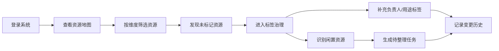
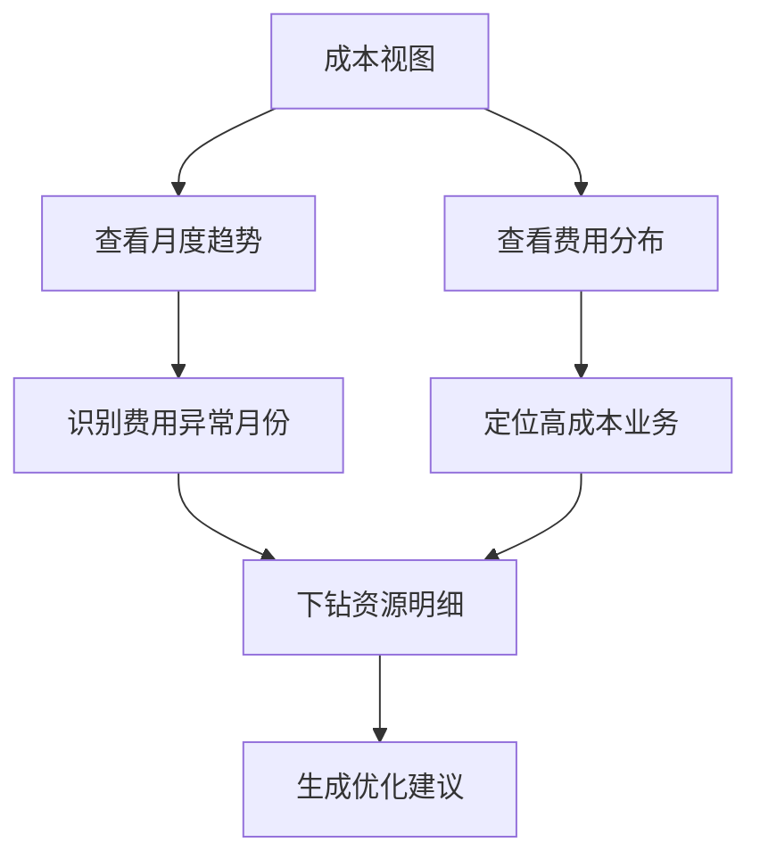

## 1. 产品概述

云资源地图是面向企业云管理员的可视化管理平台，帮助梳理多云账号、区域、业务系统与底层资源之间的拓扑关系，实现资源可观测、成本可追踪、标签可治理。

- 目标用户：企业云运维工程师、云架构师、IT 资产管理员
- 核心价值：降低云资源管理复杂度，提升资源利用率，强化标签治理规范

## 2. 核心功能

### 2.1 用户角色

| 角色 | 登录方式 | 核心权限 |
|------|----------|----------|
| 云管理员 | 账号密码 / SSO | 全部功能：查看地图、编辑标签、导出清单、生成任务 |
| 部门负责人 | 账号密码 / SSO | 仅查看本部门资源及成本数据 |

### 2.2 功能模块

1. **资源地图**：拓扑关系可视化，节点分层展示账号→区域→应用→资源
2. **资源清单**：多维度筛选、搜索、分页、导出部门资源清单
3. **成本视图**：月度费用趋势、按账号/区域/业务维度费用占比
4. **标签治理**：闲置资源识别、高风险暴露项标记、负责人与用途标签补全
5. **变更记录**：资源归属变更历史、待整理任务生成与追踪

### 2.3 页面详情

| 页面名称 | 模块名称 | 功能描述 |
|----------|----------|----------|
| 资源地图 | 顶部筛选栏 | 按云账号、区域、业务系统筛选，资源类型过滤 |
| 资源地图 | 拓扑图区域 | 力导向布局展示四层节点关系，支持缩放拖拽、节点点击详情 |
| 资源地图 | 右侧详情面板 | 展示选中节点的基本信息、标签、关联资源、成本概览 |
| 资源清单 | 高级筛选区 | 多条件组合筛选，支持保存常用筛选条件 |
| 资源清单 | 资源列表 | 表格展示，支持排序、分页、批量操作、搜索资源名称 |
| 资源清单 | 导出功能 | 按部门导出 CSV/Excel 格式资源清单 |
| 成本视图 | 费用趋势图 | 近 12 个月费用走势折线图，支持多维度切换 |
| 成本视图 | 费用分布 | 饼图/柱状图展示各账号、区域、业务系统费用占比 |
| 成本视图 | 成本明细 | 按资源类型排名的 Top N 费用列表 |
| 标签治理 | 标签覆盖率 | 按维度展示标签覆盖率统计卡片 |
| 标签治理 | 闲置资源 | 识别低利用率资源，支持一键标记待清理 |
| 标签治理 | 风险暴露项 | 公网 IP、安全组宽放等高风险项列表及标记 |
| 标签治理 | 标签编辑器 | 批量补充负责人、用途、环境等标签 |
| 变更记录 | 变更历史 | 资源归属、标签变更时间线，支持筛选与搜索 |
| 变更记录 | 待整理任务 | 自动生成待整理任务清单，支持分配、标记完成 |

## 3. 核心流程

### 3.1 资源探查与梳理流程

云管理员登录后，首先在资源地图查看全局拓扑，确认资源分布是否合理；发现归属不明确的资源后，进入标签治理页面补充负责人和用途标签；对于长期闲置的资源，生成待整理任务并跟进处理。

### 3.2 成本分析流程

云管理员定期查看成本视图，分析费用趋势与构成；识别费用突增或占比异常的业务系统，下钻查看明细资源，进而优化成本结构。

## 4. 用户界面设计

### 4.1 设计风格

- **设计语言**：深色科技感企业级界面，强调专业感与数据密度
- **主色调**：深海蓝 (#0F172A) 背景 + 电光青 (#06B6D4) 主强调色
- **辅助色**：翡翠绿 (#10B981) 正常状态、琥珀橙 (#F59E0B) 警告、玫瑰红 (#F43F5E) 高风险
- **字体**：Inter 为主字体，等宽字体用于资源 ID、IP 等技术数据
- **布局**：左侧固定导航 + 顶部筛选条 + 主内容区，卡片式信息分组
- **图标风格**：线性图标，统一 24px 网格，配合状态色使用

### 4.2 页面设计概览

| 页面名称 | 模块名称 | UI 元素 |
|----------|----------|---------|
| 资源地图 | 拓扑画布 | 深色画布、发光节点、连线脉冲动画、缩放控件 |
| 资源地图 | 节点详情卡 | 玻璃拟态浮层、标签芯片、关联列表 |
| 资源清单 | 筛选区 | 下拉选择器、搜索框、标签芯片组、重置按钮 |
| 资源清单 | 数据表格 | 斑马纹、行悬停高亮、状态徽标、分页器 |
| 成本视图 | 图表区 | 渐变面积图、环形进度图、数据卡片网格 |
| 标签治理 | 统计卡片 | 大数字 + 趋势箭头 + 进度环，悬停微动效 |
| 标签治理 | 列表区 | 可展开行、批量操作工具栏、风险等级色条 |
| 变更记录 | 时间线 | 纵向时间轴、事件卡片、状态徽章 |
| 变更记录 | 任务面板 | 任务卡片、进度条、分配下拉、完成勾选 |

### 4.3 响应式

- 桌面端优先设计，最小支持 1280px 宽度
- 平板端（≥768px）：侧边栏可折叠为图标模式
- 移动端：顶部导航抽屉式展开，图表与表格单列堆叠

### 4.4 动效与交互

- 页面载入：元素错峰淡入（staggered fade-in），从导航到内容逐级显现
- 拓扑节点：悬停放大 + 光晕增强，点击时脉冲扩散动画
- 数据更新：数字滚动动画（count-up），图表平滑过渡
- 侧边导航：选中项青色指示条滑动过渡
- 卡片悬停：轻微上浮 + 阴影加深 + 边框高亮
