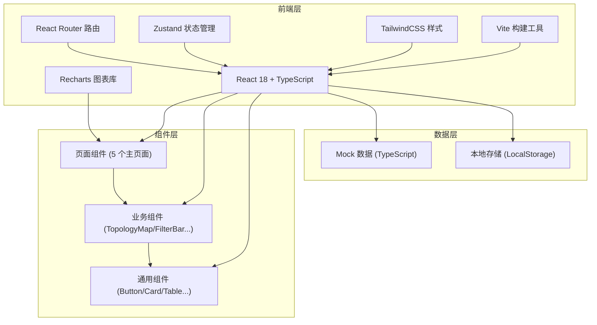
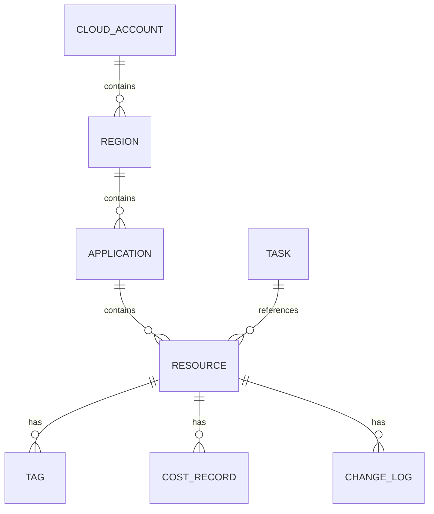

## 1. 架构设计



## 2. 技术栈描述

- **前端框架**：React 18 + TypeScript
- **构建工具**：Vite 5
- **样式方案**：TailwindCSS 3 + CSS Variables
- **状态管理**：Zustand
- **路由管理**：React Router v6
- **图表库**：Recharts
- **图标库**：Lucide React
- **数据**：前端 Mock 数据 + LocalStorage 持久化
- **无后端**：纯前端实现，数据通过 Mock 模拟

## 3. 路由定义

| 路由路径 | 页面名称 | 说明 |
|----------|----------|------|
| `/` | 资源地图 | 默认首页，展示拓扑关系图 |
| `/inventory` | 资源清单 | 资源列表 + 筛选 + 搜索 + 导出 |
| `/cost` | 成本视图 | 费用趋势 + 分布 + 明细 |
| `/governance` | 标签治理 | 覆盖率 + 闲置 + 风险 + 标签编辑 |
| `/changes` | 变更记录 | 变更历史 + 待整理任务 |

## 4. 数据模型

### 4.1 核心实体关系



### 4.2 主要数据类型

```typescript
// 云账号
interface CloudAccount {
  id: string;
  name: string;
  provider: 'aliyun' | 'aws' | 'tencent' | 'huawei';
  status: 'active' | 'suspended';
  regionCount: number;
  resourceCount: number;
}

// 区域
interface Region {
  id: string;
  accountId: string;
  name: string;
  nameEn: string;
  appCount: number;
}

// 业务系统/应用
interface Application {
  id: string;
  regionId: string;
  name: string;
  department: string;
  owner: string;
  resourceCount: number;
  monthlyCost: number;
}

// 云资源
interface CloudResource {
  id: string;
  appId: string;
  name: string;
  type: 'ecs' | 'oss' | 'slb' | 'rds' | 'redis' | 'vpc' | 'eip';
  status: 'running' | 'stopped' | 'idle' | 'error';
  ip?: string;
  tags: Tag[];
  createdAt: string;
  monthlyCost: number;
  isIdle: boolean;
  isRisk: boolean;
  riskReason?: string;
}

// 标签
interface Tag {
  key: string;
  value: string;
}

// 费用记录
interface CostRecord {
  month: string;
  accountId?: string;
  regionId?: string;
  appId?: string;
  resourceType?: string;
  amount: number;
}

// 变更记录
interface ChangeLog {
  id: string;
  resourceId: string;
  resourceName: string;
  type: 'owner_change' | 'tag_change' | 'status_change';
  before: string;
  after: string;
  operator: string;
  time: string;
}

// 待整理任务
interface Task {
  id: string;
  title: string;
  type: 'idle_cleanup' | 'tag_complete' | 'risk_fix';
  status: 'pending' | 'in_progress' | 'completed';
  assignee?: string;
  resourceIds: string[];
  createdAt: string;
  dueDate?: string;
  priority: 'high' | 'medium' | 'low';
}
```

## 5. 项目结构

```
src/
├── components/          # 通用组件
│   ├── Layout/         # 布局组件
│   ├── Sidebar/        # 侧边导航
│   ├── Card/           # 卡片组件
│   ├── Table/          # 表格组件
│   ├── FilterBar/      # 筛选栏
│   ├── TagBadge/       # 标签徽章
│   └── StatusBadge/    # 状态徽章
├── pages/              # 页面组件
│   ├── ResourceMap/    # 资源地图
│   ├── Inventory/      # 资源清单
│   ├── CostView/       # 成本视图
│   ├── Governance/     # 标签治理
│   └── Changes/        # 变更记录
├── store/              # Zustand 状态
│   ├── useResourceStore.ts
│   └── useFilterStore.ts
├── data/               # Mock 数据
│   ├── accounts.ts
│   ├── resources.ts
│   ├── costs.ts
│   └── tasks.ts
├── types/              # 类型定义
│   └── index.ts
├── utils/              # 工具函数
│   ├── format.ts
│   └── export.ts
├── App.tsx
├── main.tsx
└── index.css
```

## 6. 状态管理设计

使用 Zustand 管理全局状态：

- **FilterStore**：全局筛选条件（账号、区域、业务系统、搜索关键词）
- **ResourceStore**：资源数据、当前选中资源、详情面板状态
- **TaskStore**：待整理任务列表及状态

## 7. 性能优化点

- 拓扑图节点虚拟化，大数据量下保持流畅
- 列表数据分页 + 虚拟滚动
- 图表数据按需加载
- 状态变更最小化重渲染
